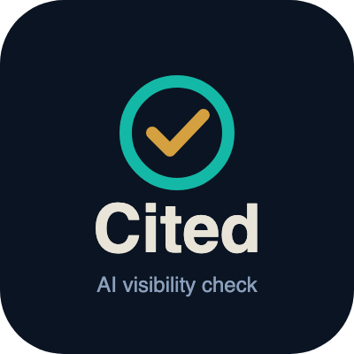

<p align="center"></p>

<h1 align="center">Cited AI Visibility Check (MCP server)</h1>

<p align="center">Ask ChatGPT, Perplexity and Gemini the questions your customers ask, with live web search on, and see whether they recommend your business.<br>By <a href="https://cited.voreli.ai">Cited</a>, the AI visibility tracker from <a href="https://www.voreli.ai">Voreli AI</a>.</p>

---

`cited-mcp` is an open-source [Model Context Protocol](https://modelcontextprotocol.io) server. Add it to Claude Desktop, Claude Code, Cursor or any MCP client, then ask something like:

> Check whether AI engines recommend Sunshine Dental (sunshinedental.com) for family dentist questions in Tampa, FL.

For every question and engine it reports:

- whether the business was **named** in the answer
- its **position** if the answer was a list
- whether its **website was cited** as a source
- which **competitors** were named
- the **source domains** the engine leaned on
- an estimated **cost** for the call, from token usage at list prices

## Tool

### `check_ai_visibility`

| Argument | Required | Notes |
|---|---|---|
| `business_name` | yes | e.g. `Sunshine Dental & Implants, LLC` |
| `website` | no | e.g. `sunshinedental.com`. Used to detect citations of your pages. |
| `questions` | no | 1 to 10 buyer questions. |
| `category` | if no questions | e.g. `family dentist`. Generates 5 generic buyer questions. |
| `location` | no | e.g. `Tampa, FL`. Used in generated questions. |
| `engines` | no | Any of `openai`, `perplexity`, `gemini`. Default: every engine with a key. |

Name matching ignores case and punctuation, treats `&` and `and` as the same, drops legal suffixes such as LLC, Inc and Co, and also counts a mention of your website domain. Website citation matches the domain and its subdomains against every URL the engine cited.

## Install

You bring your own API keys and pay each provider directly. Set any one, two or all three; engines without a key are skipped with a note.

### Claude Desktop

Edit `claude_desktop_config.json` (Settings, Developer, Edit Config):

```json
{
  "mcpServers": {
    "cited": {
      "command": "npx",
      "args": ["-y", "cited-mcp"],
      "env": {
        "OPENAI_API_KEY": "sk-...",
        "PERPLEXITY_API_KEY": "pplx-...",
        "GEMINI_API_KEY": "..."
      }
    }
  }
}
```

### Claude Code

```bash
claude mcp add cited -e OPENAI_API_KEY=sk-... -e PERPLEXITY_API_KEY=pplx-... -e GEMINI_API_KEY=... -- npx -y cited-mcp
```

### Cursor

Add to `~/.cursor/mcp.json` (or `.cursor/mcp.json` in a project):

```json
{
  "mcpServers": {
    "cited": {
      "command": "npx",
      "args": ["-y", "cited-mcp"],
      "env": {
        "OPENAI_API_KEY": "sk-...",
        "PERPLEXITY_API_KEY": "pplx-...",
        "GEMINI_API_KEY": "..."
      }
    }
  }
}
```

Any other MCP client works the same way: run `npx -y cited-mcp` over stdio with the keys in its environment. Node 20 or newer.

## Environment variables

| Variable | Engine | Default model |
|---|---|---|
| `OPENAI_API_KEY` | ChatGPT via the OpenAI Responses API with the `web_search` tool | `gpt-5.4-mini` (override with `OPENAI_MODEL`) |
| `PERPLEXITY_API_KEY` | Perplexity Sonar (search is built in) | `sonar` (override with `PERPLEXITY_MODEL`) |
| `GEMINI_API_KEY` | Gemini with Grounding with Google Search | `gemini-3.5-flash-lite` (override with `GEMINI_MODEL`) |

The API versions of these engines are close to, but not the same as, the consumer apps. ChatGPT, Perplexity and Gemini in the browser can use different models, personalization and location signals.

## Example output

This is the tool's real output format, run against the sample responses in `test/fixtures`, which follow each provider's documented response format (the businesses are made up):

```text
# AI visibility check: Sunshine Dental & Implants (sunshinedental.com)

- ChatGPT (OpenAI API): named in 1 of 1 answers, website cited in 1
- Perplexity: named in 0 of 1 answers, website cited in 0
- Gemini: named in 1 of 1 answers, website cited in 1

## "What is the best dentist in Tampa, FL?"
- ChatGPT (OpenAI API): NAMED, #2 of 3 listed, website cited
  - Named instead: Bayshore Smiles, Harbor Family Dentistry
  - Sources: bayshoresmiles.com, yelp.com, sunshinedental.com
- Perplexity: not named, website not cited
  - Named instead: Harbor Family Dentistry, Bayshore Smiles, Westshore Dental Group
  - Sources: yelp.com, bayshoresmiles.com, healthgrades.com
- Gemini: NAMED, #2 of 3 listed, website cited
  - Named instead: Westshore Dental Group, Bayshore Smiles
  - Sources: sunshinedental.com, yelp.com

Estimated provider cost: $0.0229. AI answers change from run to run, so treat one check as a snapshot, not a score. Costs are estimates from token usage at list prices; you pay your provider directly.

Track this weekly with Cited: https://cited.voreli.ai
```

The tool also returns the same data as structured JSON (`structuredContent`) for clients that use it.

## Cost

There is no Cited fee and no account. Each question is one API call per engine, billed to your own provider account at their list prices (checked October 2026):

| Engine | What you pay per question |
|---|---|
| OpenAI `gpt-5.4-mini` | $10 per 1,000 web search calls, plus tokens at $0.75 per 1M input and $4.50 per 1M output. Search results count as input tokens. |
| Perplexity `sonar` | $5 per 1,000 requests (low search context), plus tokens at $1 per 1M. Perplexity reports the exact cost and the tool uses it. |
| Gemini `gemini-3.5-flash-lite` | See Google's current Gemini API pricing (https://ai.google.dev/gemini-api/docs/pricing). The cost estimate shows $0 for models without a built-in price; check your Google billing for the real figure. |

In practice that is a few cents or less per question per engine, so a default check (5 questions on 3 engines, 15 calls) should land well under a dollar. Every result includes an estimate computed from the token counts the provider returned. It does not include Gemini grounding fees past the free daily allowance. Check your provider dashboard for the exact charge. Prices change; see [OpenAI](https://developers.openai.com/api/docs/pricing), [Perplexity](https://docs.perplexity.ai/getting-started/pricing) and [Gemini](https://ai.google.dev/gemini-api/docs/pricing).

### Run one live check

```bash
PERPLEXITY_API_KEY=your-key npm run live
```

Uses whichever of `OPENAI_API_KEY`, `PERPLEXITY_API_KEY` and `GEMINI_API_KEY` are set. Override the target with `BUSINESS`, `WEBSITE`, `LOCATION` and `QUESTION`. A single check costs a few cents.

## Limitations

- **Answers vary from run to run.** In our [Tampa Bay AI Search Study 2026](https://www.voreli.ai/research/tampa-bay-ai-search-2026), we asked ChatGPT the same 12 questions twice. On average the two answers shared 11% of the businesses they named, and on 6 of the 12 questions they shared none. One check is a snapshot. Trends need repeated checks over time.
- **API is not the app.** Results approximate what people see in the consumer apps; they are not identical.
- **Competitor names are pulled heuristically** from list items, headings and bold text. Expect the odd miss or stray phrase. The answer excerpt is included so your assistant can read it directly.
- **Name matching is fuzzy, not magic.** A nickname or abbreviation the engine uses (for example "SDI" for Sunshine Dental & Implants) will not match unless you pass it as the business name.
- **Location.** The engines infer location from the question text, so put the city in the question.

## Tracking it over time

This server answers "are we named today?". [Cited](https://cited.voreli.ai) runs the same questions every week across engines, stores the history, and shows which competitors and sources are winning so you can see whether your work is moving the number.

## Related free tools

- [llms.txt Generator and Checker](https://www.voreli.ai/tools/llms-txt-generator): validate a site's `/llms.txt` against the llmstxt.org spec, or draft one from its sitemap.
- [Tampa Bay AI Search Study 2026](https://www.voreli.ai/research/tampa-bay-ai-search-2026): the open dataset behind the variance numbers above.

## Development

```bash
npm install
npm test          # unit tests against sample responses, no network
npm run typecheck
npm run build
npm run smoke     # spawns the server over stdio, lists tools, runs a no-key call
```

To try it with the MCP Inspector: `npx @modelcontextprotocol/inspector node dist/index.js`.

## License

MIT. Built by [Voreli AI](https://www.voreli.ai). Questions or ideas: open an issue, or visit [cited.voreli.ai](https://cited.voreli.ai).
